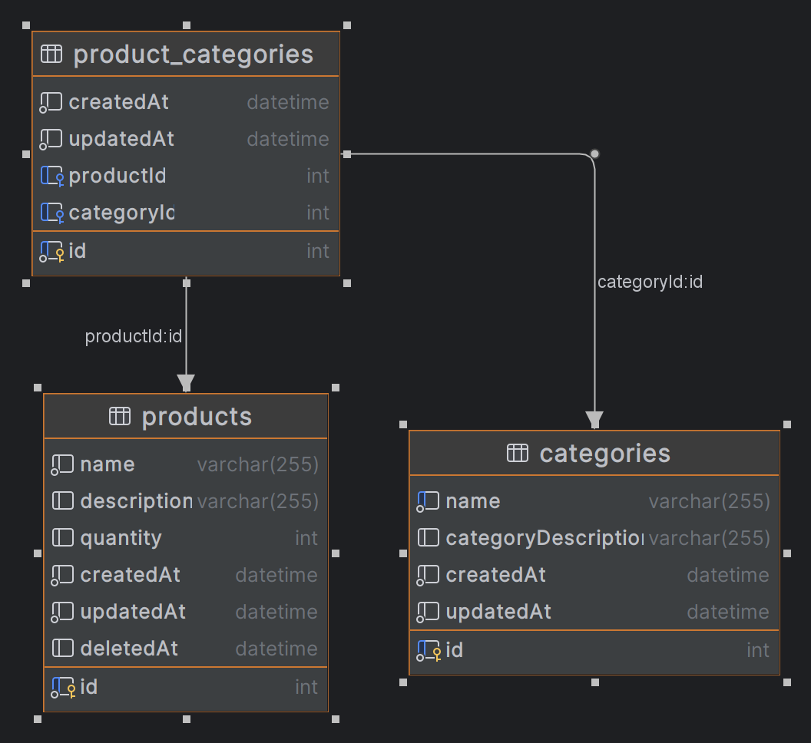
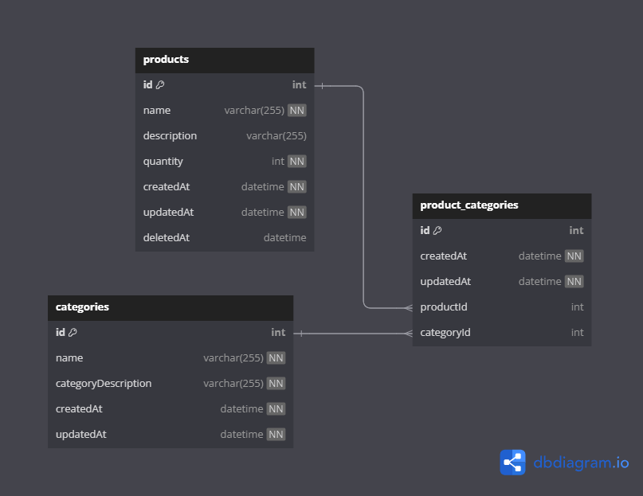

# Database Diagram Generation with DataGrip and dbdiagram.io

## Tools Used

### DataGrip

DataGrip is an integrated development environment (IDE) for databases developed by JetBrains. It supports multiple database systems including MySQL, PostgreSQL, SQL Server, and more. One of its features is the ability to generate diagrams representing the structure of a database.

### dbdiagram.io

dbdiagram.io is an online tool for designing and documenting database schemas. It allows users to define database schemas using a simple and intuitive syntax and then generates interactive and visually appealing diagrams automatically.

## Diagrams

- **DataGrip Diagram:**
  

- **dbdiagram.io Diagram:**
  